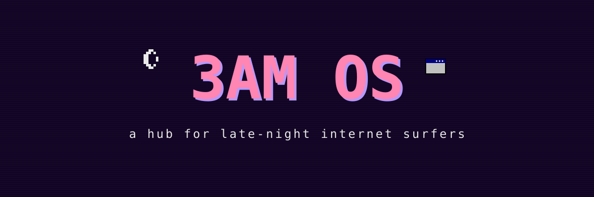
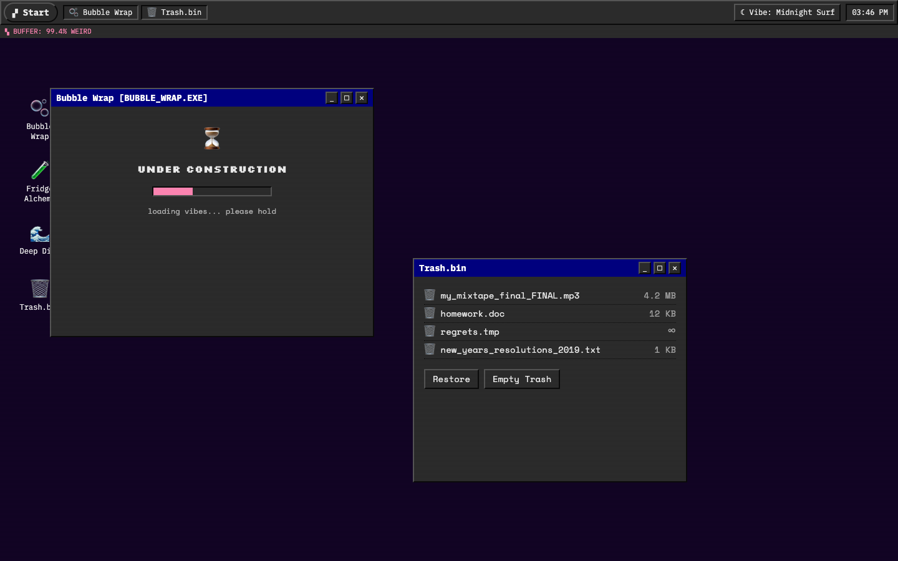
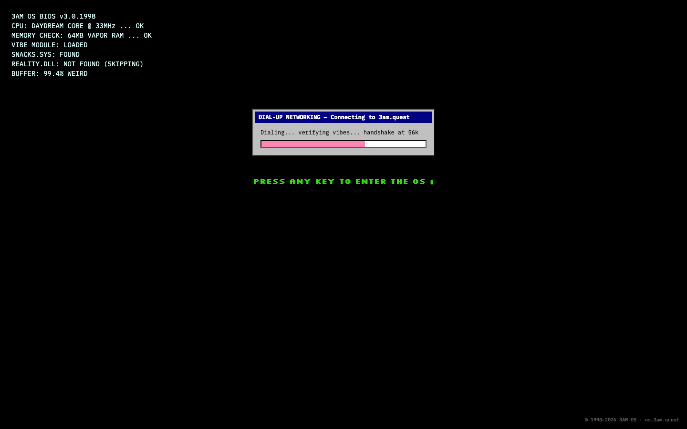
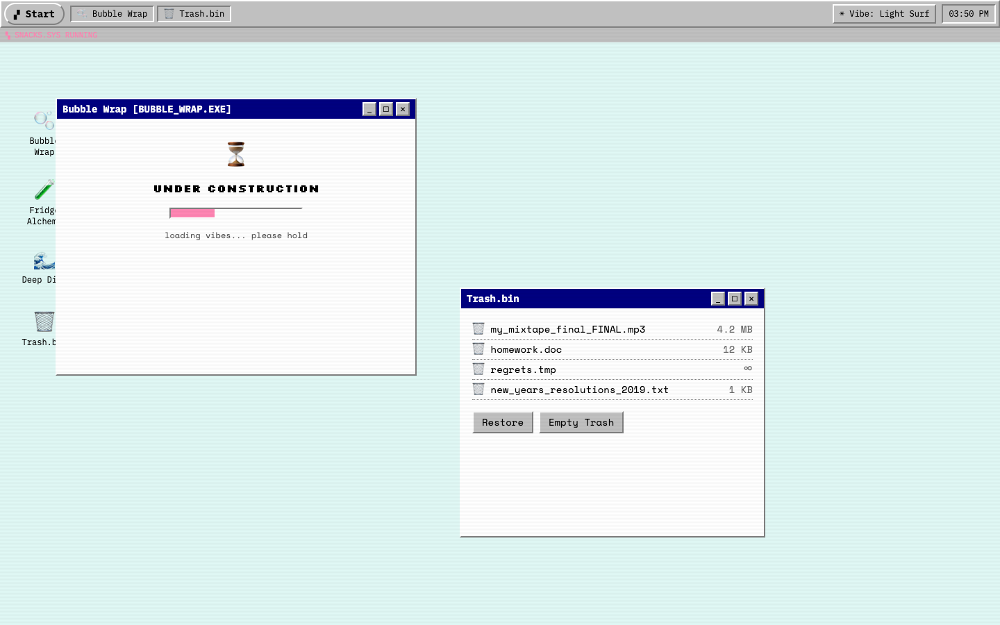
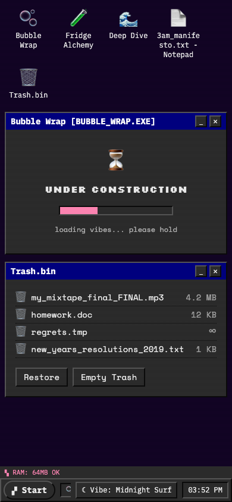

<p align="center">
  
</p>

<p align="center">
  <a href="https://github.com/cpt-nem0/3am-os/actions/workflows/ci.yml"></a>
  
  
  
</p>

A vaporwave operating system that lives in your browser. Boot it up, drag some windows around, and stay a while — it's 3 AM somewhere.

Visit **[os.3am.quest](https://os.3am.quest)** *(coming soon)* · or run it locally in 30 seconds ↓

## What is this?

3AM OS is a browser-based retro "desktop" — imagine powering on a machine from 1998 in the middle of the night. It boots through a BIOS sequence, dials up at 56k, and drops you on a desktop full of windows and weird little apps.

- 🪟 **A real window system** — drag by the title bar, minimize to the taskbar, maximize to fullscreen, cascade to your heart's content
- 🌗 **Two vibes** — "Light Surf" (classic enterprise gray) and "Midnight Surf" (deep grid purple), one click apart, remembered between visits
- 💾 **A BIOS boot sequence** — `VIBE MODULE: LOADED`, `REALITY.DLL: NOT FOUND (SKIPPING)`, press any key to enter the OS
- 🔗 **Every app is a link** — `os.3am.quest/?open=deep-dive` opens straight into an app
- 📱 **Works on your phone** — windows become stacked cards, the taskbar docks to your thumb
- 🧩 **Built to be contributed to** — your mini-app is one folder + one registry entry away

## Screenshots

**Midnight Surf** — the default. It's called 3AM OS for a reason.



**The boot sequence** — every session starts at the BIOS.



**Light Surf** — same OS, lights on. Classic '95 gray, navy title bars.



**On your phone** — windows stack, the taskbar moves to the bottom.

<p align="center">
  
</p>

## Quick Start

**Prerequisites:** Node.js 22+ and npm.

```bash
git clone https://github.com/cpt-nem0/3am-os.git
cd 3am-os
npm install                      # add --legacy-peer-deps if npm complains about peers
npm run dev
```

Open [http://localhost:3000](http://localhost:3000). Press any key to enter the OS.

### Verify before a PR

```bash
npm run lint       # ESLint
npx tsc --noEmit   # TypeScript
npm test           # Vitest (npm test -- --max-workers=2 if slow)
npm run build      # production build
```

CI runs exactly these four on every pull request.

## Contributing

**This project is built to be contributed to.** Adding a mini-app takes one folder and one registry entry — a desktop icon, Start-menu entry, and shareable link appear automatically. And inside your window, your app is *its own world*: it does not have to follow the vaporwave design. Neon terminal, pastel garden, generative art piece — all welcome.

See **[CONTRIBUTING.md](./CONTRIBUTING.md)** for the full guide. Not ready for a whole app? Add a status-ticker message — it's a one-line PR.

The rules are short: stay inside your window, no global styles, client-side only, keep it cozy and weird.

## Roadmap

**Phase 1 — the shell** *(you are here)*
- ✅ Desktop, window manager, boot sequence, taskbar, vibes
- ✅ Contributor framework + CI
- 🚧 Real versions of the three launch apps (Bubble Wrap, Fridge Alchemy, Deep Dive — currently under-construction stubs)

**Phase 2 — more OS**
- Screensaver after idle (flying-toasters energy)
- `Terminal.exe` with contributable commands
- Open community submissions

**Phase 3 — the weird web mall**
- Curated gallery of community apps
- Persistent state & favorites
- More retro OS features (wallpaper picker, vapor radio…)

## Tech Stack

Next.js (App Router) · React · TypeScript · Tailwind CSS v4 · Zustand · Motion — deployed on Vercel.

## License

TBD before public launch.

---

<p align="center">
  <sub>© 1998–2026 3AM OS · built way past bedtime · <b>PRESS ANY KEY TO ENTER THE OS ▮</b></sub>
</p>
